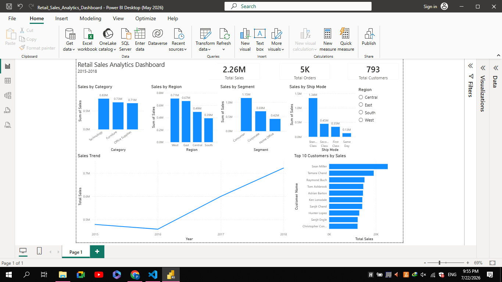

# 📊 Retail Sales Analytics Dashboard

An interactive Power BI dashboard built to analyze retail sales performance from 2015 to 2018.

## 📌 Project Overview

This project provides insights into retail sales using Power BI. The dashboard allows users to monitor sales performance, identify top customers, analyze regional sales, and explore trends over time through interactive visualizations.

---

## 📂 Dataset

- Retail Sales Dataset (`data/sample-raw.csv`)
- Period: 2015–2018
- Data cleaned with Python/Pandas (`notebooks/1-Data_loading_cleaning.ipynb`) → `data/cleaned-sample.csv`
- Exploratory analysis: `notebooks/2-EDA.ipynb`
- Power BI file: `powerbi/Retail_Sales_Analytics_Dashboard.pbix`

---

## 📈 Dashboard Features

- 💰 Total Sales KPI
- 📦 Total Orders KPI
- 👥 Total Customers KPI
- 📊 Sales by Category
- 🌍 Sales by Region
- 👤 Sales by Customer Segment
- 🚚 Sales by Shipping Mode
- 📈 Sales Trend (2015–2018)
- 🏆 Top 10 Customers by Sales
- 🎛️ Interactive Region Filter

---

## 🛠 Tools Used

- Power BI Desktop
- Python
- Pandas

---

## 📷 Dashboard Preview



---

## 📁 Files

```
retail-sales-analytics-dashboard/
├── README.md
├── dashboard.pdf
├── data/
│   ├── cleaned-sample.csv
│   └── sample-raw.csv
├── images/
│   └── dashboard.png
├── notebooks/
│   ├── 1-Data_loading_cleaning.ipynb
│   └── 2-EDA.ipynb
└── powerbi/
    └── Retail_Sales_Analytics_Dashboard.pbix
```

---

## 🎯 Key Insights

- Technology generated the highest sales.
- The West region recorded the highest revenue.
- Consumer segment contributed the largest share of sales.
- Standard Class was the most frequently used shipping mode.
- Sales increased significantly between 2016 and 2018.

---

## 👤 Author

Created by **Parnoosh Mansouri**
